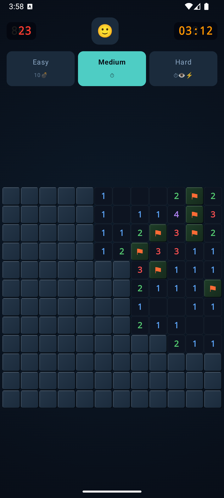
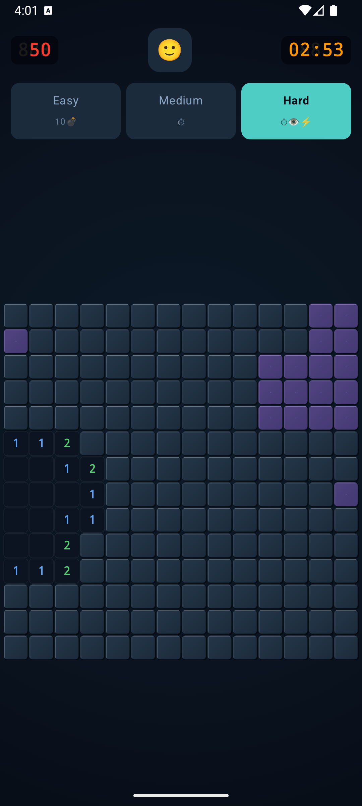
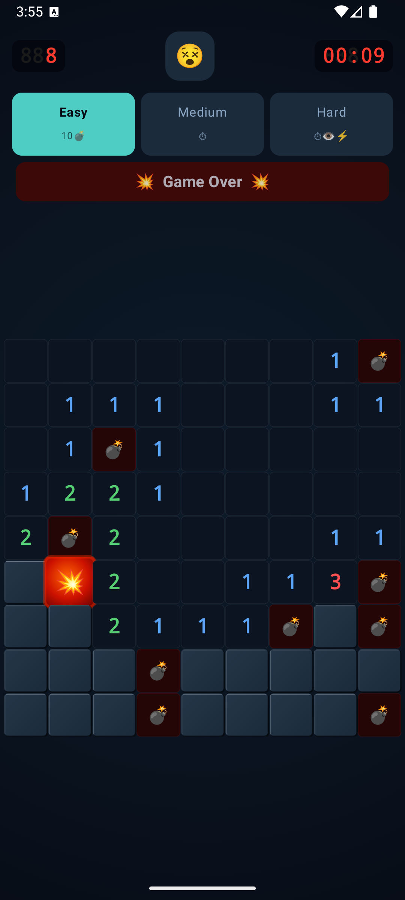

# Minesweeper

The only beautiful, private, mechanically interesting Minesweeper on Android.

No ads. No permissions. No analytics. No internet. Just the game.

[](https://f-droid.org/packages/io.github.johnathan.minesweeper)

> F-Droid listing coming soon — submission in progress.

---

Every other Minesweeper on Android is either a privacy nightmare stuffed with ads and trackers, or a bare-bones port that looks like it was built in 2009. This one is neither.

Built from scratch with Jetpack Compose and Material 3 — it looks and feels like a first-party Google app. Material You dynamic colour adapts the entire palette to your wallpaper on Android 12+. Spring physics, ripple flood-fill animations, screen shake on game over.

The three difficulty modes are mechanically distinct, not just bigger grids:

- **Easy** — 9×9, classic rules, guaranteed safe first click
- **Medium** — 12×12, higher mine density, 5-minute countdown, only your clicked cell is safe at the start
- **Hard** — 14×14, no safe start, no chord reveal, 3-minute countdown, **fog of war** — revealed cells fade out after 6 seconds and you must hold the mine map in your head

Fog of war is a novel mechanic that doesn't exist in any other Minesweeper app. It turns a memory game into a memory game.

The grid always fills the screen. Cells scale to any device. No zooming, no tiny tap targets.

---

## Screenshots

<p float="left">
  
  
  
</p>

---

## Building

Requirements: JDK 17+, Android SDK 35, Gradle (wrapper included).

```bash
git clone https://github.com/john-athan/minesweeper
cd minesweeper
./gradlew assembleDebug
# APK → app/build/outputs/apk/debug/app-debug.apk
```

Release build (unsigned):
```bash
./gradlew assembleRelease
```

---

## Tech stack

| Layer | Technology |
|---|---|
| Language | Kotlin 2.2 |
| UI | Jetpack Compose (BOM 2024.12.01) |
| Design system | Material 3 |
| Dynamic colour | Material You (Android 12+) |
| Build | AGP 9.0, Gradle 9.2 |
| Min SDK | 21 (Android 5.0) |

All dependencies are Apache 2.0 licensed (AndroidX / Jetpack). No third-party libraries, no trackers, no network calls of any kind.

---

## License

GPL-3.0-or-later — see [LICENSE](LICENSE).
